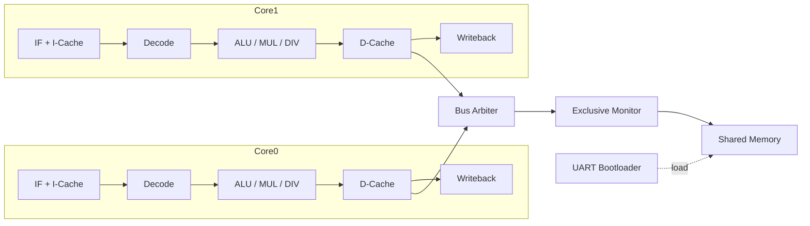

# RV32IMA Dual-Core RISC-V SoC

[](https://en.wikipedia.org/wiki/Verilog)
[](https://riscv.org/)
[](https://digilent.com/reference/programmable-logic/nexys-a7/start)
[](https://opensource.org/licenses/MIT)

A dual-core, 5-stage pipelined RISC-V processor implementing the **RV32IMA** ISA, packaged as an AXI4-Lite SoC with split L1 caches, a shared-memory bus arbiter, an exclusive-access monitor for `LR/SC`, a UART bootloader, and a Vivado top-level for the **Digilent Nexys A7-100T (Artix-7 XC7A100T-1CSG324C)**. A pre-built bitstream and XDC constraints are included so the design can be brought up on hardware without re-running synthesis.

A FastAPI web application is provided to drive the bootloader from a browser: it lists serial ports, compiles C source against the bundled `riscv64-unknown-elf` toolchain, streams the resulting `imem.hex` / `dmem.hex` to the FPGA, and renders live UART output.

---

## Architecture Overview

Each core is a classic 5-stage pipeline (IF / ID / EX / MEM / WB) with a full forwarding network, load-use stall logic, and a small branch predictor. The two cores share a backing memory through a round-robin AXI-style arbiter; atomic instructions (`LR.W` / `SC.W`) are mediated by an exclusive monitor that tracks reservation sets per core.



### Feature summary
- **ISA:** RV32I + M-extension (`MUL`, `MULH`, `DIV`, `DIVU`, `REM`, `REMU`) + A-extension (`LR.W`, `SC.W`).
- **Pipeline:** EX→EX and MEM→EX forwarding, hazard-detection unit, single-cycle load-use stall, branch flush.
- **Caches:** independent L1 I-cache and D-cache per core.
- **SoC:** AXI4-Lite top, dual-port shared memory through a fair bus arbiter, per-core exclusive monitor.
- **Boot:** UART bootloader streams `imem.hex` then `dmem.hex` into block RAM at 115200 baud.
- **FPGA top:** clock divider with selectable run rates (1 Hz / 10 Hz / 1 kHz / 50 MHz), 7-segment PC display, LED status (heartbeat, exception, UART activity).

---

## Repository Layout

| Path | Contents |
| :--- | :--- |
| [`modules/`](./modules) | Verilog RTL: cores, caches, arbiter, exclusive monitor, UART, FPGA top, testbenches. |
| [`tests/`](./tests) | Bash + Python harnesses for ISA, dual-core atomics, cache stress, UART, and SoC simulation. |
| [`mem_generator/`](./mem_generator) | Single-core C examples and `gen_fpga_hex.py` for hex generation. |
| [`c_toolchain/`](./c_toolchain) | Linker script, runtime (`boot.S`, `lib.c`), `build.sh`, and dual-core demos used by the web loader. |
| [`simulation/`](./simulation) | Vivado/XSim simulation working directory. |
| [`uart_loader_web/`](./uart_loader_web) | FastAPI backend + single-page web UI for compile-and-flash. |
| [`final_bitstream/top_fpga.bit`](./final_bitstream) | Pre-built bitstream for the Nexys A7-100T. |
| [`nexys_a7.xdc`](./nexys_a7.xdc) | Pin/clock constraints for the Nexys A7-100T. |

### RTL modules

| File | Purpose |
| :--- | :--- |
| `rv32ima_core.v` | Single RV32IMA pipeline core (IF/ID/EX/MEM/WB, forwarding, hazards). |
| `dual_core_top.v` | Two-core wrapper, instantiates cores, caches, arbiter, monitor. |
| `soc_axi_top.v` | AXI4-Lite SoC top, exposes the dual-core complex to the bus. |
| `top_fpga.v` | Nexys A7 board wrapper: clocking, reset sync, switches, LEDs, 7-seg, UART. |
| `bus_arbiter.v` | Round-robin arbiter between the two cores' memory ports. |
| `exclusive_monitor.v` | Tracks per-core reservations for `LR.W`/`SC.W`. |
| `icache.v`, `dcache.v` | Per-core L1 instruction and data caches. |
| `branch_predictor.v` | Direction predictor used in IF. |
| `execute.v`, `divider.v` | ALU and multi-cycle integer divider/multiplier. |
| `hazard_forward_unit.v` | Combined forwarding + stall logic. |
| `IF_ID.v`, `ex_mem_reg.v`, `mem_wb_reg.v` | Pipeline registers. |
| `mem_stage.v`, `wb.v`, `memory.v` | Memory access, writeback, backing RAM. |
| `csr_perf.v` | Performance counters (cycle / instret). |
| `uart_bootloader.v`, `uart_rx.v`, `uart_tx.v` | 115200-baud UART loader and link-layer. |
| `opcode.vh` | Shared opcode/funct constants. |
| `tb_*.v` | Self-checking testbenches (see *Simulation* below). |

---

## Toolchain Setup

The flow targets **Git Bash on Windows**; the same scripts work unchanged on Linux/macOS.

### 1. Git Bash (Windows)
Install Git for Windows from <https://git-scm.com/download/win>. Right-click in the project folder and pick **Git Bash Here**. Avoid invoking `bash` from PowerShell/CMD if it resolves to WSL — the web loader will reject WSL's `System32\bash.exe`.

### 2. RISC-V GCC (`riscv64-unknown-elf`)
The C build script in `c_toolchain/build.sh` invokes `riscv64-unknown-elf-gcc` and `-objcopy`. Install via xPack:
```bash
npm install --global xpm
xpm install --global @xpack-dev-tools/riscv-none-elf-gcc
```
Add the xPack `bin` directory to `PATH` (typically `C:\Users\<user>\AppData\Roaming\xPacks\@xpack-dev-tools\riscv-none-elf-gcc\<ver>\.content\bin`). If your distribution exposes the toolchain as `riscv-none-elf-gcc`, alias or symlink it to `riscv64-unknown-elf-gcc`, which is the name used by `build.sh`.

Verify:
```bash
riscv64-unknown-elf-gcc --version
```

### 3. Icarus Verilog + GTKWave
Used by the simulation testbenches.
- Windows: <http://bleyer.org/icarus/> (tick **Add to PATH**), or `choco install icarus-verilog gtkwave`.
- Linux: `sudo apt install iverilog gtkwave`.
- macOS: `brew install icarus-verilog gtkwave`.

Verify with `iverilog -v` and `gtkwave --version`.

### 4. Python 3
Required by hex generators and the web backend. Install from <https://www.python.org/downloads/> and tick **Add Python to PATH**. Verify with `python --version`.

### 5. Vivado (optional)
Only required to re-synthesize. The pre-built `final_bitstream/top_fpga.bit` is sufficient to bring up the board. Tested with Vivado 2023.x targeting `xc7a100tcsg324-1`.

---

## Hardware Bring-Up (Nexys A7-100T)

1. **Program the FPGA.** Open Vivado Hardware Manager, **Open Target → Auto Connect**, then **Program Device** and select `final_bitstream/top_fpga.bit`. To rebuild from source, create a new Vivado project targeting `xc7a100tcsg324-1`, add every `.v`/`.vh` from `modules/` plus `nexys_a7.xdc`, set `top_fpga` as the top module, and run synthesis → implementation → bitstream.
2. **Connect UART.** The board's onboard USB-UART enumerates as a COM port (no extra cable required); it maps to `JA1`/`JA2` per the XDC.
3. **Switch configuration:**
   - `SW[15:14] = 11` — 50 MHz core clock (required for 115200-baud UART).
   - `SW[2]   = 1` — bootloader mode (CPU stalled, UART loader active).
   - `SW[0]   = 1` — run enable, asserted before lowering `SW[2]`.
   - `SW[1]`, `SW[13]` — select Core 0/Core 1 for 7-segment / LED PC display.
4. **Load a program.** Use the web UI (below) or any terminal that can send a file. After streaming `imem.hex` then `dmem.hex`, drop `SW[2]=0` to release the cores.
5. **Reset** with `BTNC` at any time; LED[11] indicates run state, LEDs[10] / [12] / [13] reflect UART activity and per-core heartbeat.

Detailed pin assignments and the full LED legend are documented at the top of `modules/top_fpga.v`.

---

## Web-Based UART Loader

`uart_loader_web/` hosts a FastAPI backend and a single-page UI that wraps the entire compile → flash → monitor loop.

### Launch
```bash
cd uart_loader_web
bash ./run_backend.sh
```
`run_backend.sh` provisions a local `.venv`, installs `requirements.txt` (FastAPI, Uvicorn, pyserial, Jinja2, python-multipart), and starts Uvicorn on `http://127.0.0.1:8000`.

If you see `bad interpreter: /bin/bash^M`, your checkout has CRLF line endings — run `git add --renormalize .` once. The repo's `.gitattributes` enforces LF for `*.sh`.

### What the UI does
- **`GET /api/ports`** — enumerates serial devices via `pyserial`.
- **`POST /api/program`** — accepts uploaded `imem.hex` / `dmem.hex` and streams them at 115200 baud.
- **`POST /api/compile_and_load`** — writes the editor buffer to `c_toolchain/demo.c`, runs `c_toolchain/build.sh` (RISC-V GCC + `objcopy` + `make_hex.py`), then streams the generated hex pair.
- **`WS /ws`** — pushes UART bytes from the FPGA to the in-page terminal in real time.

After flashing the UI prompts you to flip `SW[2]=0` to release the cores and watch output stream into the embedded terminal.

---

## Simulation & Testbenches

All testbenches live under `modules/` and are driven by Bash scripts in `tests/`. Hex stimuli are generated on the fly by Python helpers in the same directory.

### Single-core ISA suite
```bash
cd tests
bash run_all_tests.sh
```
Compiles `modules/pipeline.v` + `modules/tb_pipeline.v` and runs:
- `test_forward` — EX→EX and MEM→EX forwarding, `x0` bypass.
- `test_hazard` — load-use stall + forwarding interaction.
- `test_branch` — taken/not-taken branches and `JAL`.
- `test_muldiv` — full M-extension matrix including divide-by-zero semantics.
- `test_auipc`, `test_alu` — PC-relative addressing and ALU op coverage.

Each case asserts expected memory-store values; the script exits non-zero on any mismatch.

### Cache stress
```bash
bash run_cache_stress_tests.sh
```
Drives the I-cache and D-cache with worst-case access patterns (eviction storms, write-back collisions) using `gen_hex_stress.py` and `cache_stress_tests.py`.

### Dual-core atomics
```bash
bash run_dual_core_tests.sh        # self-checking LR/SC suite
bash run_dual_core_testbench.sh    # raw waveform-generating run
```
Validates `LR.W`/`SC.W` semantics on a single core and dual-core spinlock contention against `tb_dual_core.v` / `tb_atomic.v`.

### Branch predictor
```bash
bash run_branch_predictor_tb.sh
```
Standalone microbenchmark of `tb_branch_predictor.v`.

### M-extension edge cases
```bash
bash run_edgecases_tb.sh
```
Runs `tb_edge_cases_muldiv.v` (signed/unsigned overflow, divide-by-zero, `MULH` corner cases).

### UART bootloader
```bash
bash run_bootloader_tb.sh
```
Compiles `tb_uart_bootloader.v` and replays a synthetic UART byte stream to confirm the loader writes the expected addresses.

### SoC / AXI tests
```bash
bash run_soc_tests.sh
bash run_soc_uart_testbench.sh
```
Exercise `tb_soc.v` and the SoC + UART integration end-to-end, producing `soc_uart_waveforms.vcd` viewable in GTKWave.

### Manual single test
```bash
cd tests
python gen_hex.py test_alu
iverilog -g2005 -o sim -I ../modules ../modules/pipeline.v ../modules/tb_pipeline.v
vvp sim
gtkwave pipeline_waveforms.vcd
```

---

## Compiling C for the Cores

`c_toolchain/build.sh` is the canonical flow used by both the CLI and the web loader:
```bash
cd c_toolchain
bash build.sh        # compiles boot.S + lib.c + demo.c → imem.hex / dmem.hex
```
`build.sh` invokes `riscv64-unknown-elf-gcc` with `-march=rv32ima_zicsr -mabi=ilp32 -O1 -ffreestanding -nostdlib -mstrict-align`, splits `.text` and `.data`/`.bss` segments via `objcopy`, and converts the binaries to Verilog `$readmemh`-compatible hex with `make_hex.py`.

Edit `demo.c` (or replace it through the web UI) to change the firmware. Helper sources `core0_factorial.c`, `core1_fibonacci.c`, `matrix_mult.c`, `spsc_queue_test.c`, and `atomic_transaction_test.c` demonstrate the runtime API in `lib.h` (`mutex_lock`, `atomic_read`/`atomic_write`, `print_str`, etc.) and can be wired in through the alternate build scripts (`edge_build.sh`, `matrix_build.sh`, `spsc_build.sh`).

---

## License

Released under the MIT License — see [LICENSE](LICENSE).
