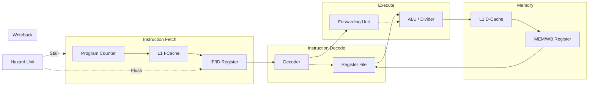

# 🚀 RISC-V 5-Stage Pipelined Processor (RV32IM)

[](https://en.wikipedia.org/wiki/Verilog)
[](https://riscv.org/)
[](https://opensource.org/licenses/MIT)

This repository contains a high-performance **5-stage pipelined processor** implementing the **RISC-V RV32IM** Instruction Set Architecture. Designed for efficiency and scalability, it features advanced hazard handling, data forwarding, and a dedicated L1 Cache subsystem.

---

## 🏛️ Architecture Overview

The core is built around a classic 5-stage RISC-V pipeline, optimized to eliminate stalls and maximize throughput.

### ⚡ Pipeline Stages
1.  **Instruction Fetch (IF)**: Interfaces with the **L1 I-Cache** to fetch 32-bit instructions. Features a **Branch Predictor** to minimize control hazards.
2.  **Instruction Decode (ID)**: Decodes opcodes, manages the 32-register File, and extends immediate values.
3.  **Execute (EX)**: Contains a high-speed **ALU** for arithmetic/logic and a dedicated **Hardware Divider/Multiplier (M-Extension)**.
4.  **Memory Access (MEM)**: Interfaces with the **L1 D-Cache** for high-bandwidth data loads and stores.
5.  **Writeback (WB)**: Commits results back to the architectural register file.

### 🧠 Advanced Features
*   **Fully Bypassed Pipeline**: Comprehensive **Forwarding Unit** (EX→EX and MEM→EX) to resolve data hazards without stalling.
*   **Hazard Detection Unit**: Automatically handles **Load-Use hazards** by injecting single-cycle pipeline stalls.
*   **Branch/Jump Management**: Immediate pipeline flushing on mispredicted branches and jumps.
*   **Cache Subsystem**: Independent L1 Instruction and Data caches for reduced memory latency.
*   **RV32M Support**: Hardware implementation of `MUL`, `DIV`, and `REM` instructions.

---

## 🏗️ Architecture Deep-Dive

The processor implements a **strictly decoupled 5-stage pipeline** to maximize clock frequency while maintaining low complexity.



---

## 📂 Project Structure

| Directory | Description |
| :--- | :--- |
| [`modules/`](./modules) | Core Verilog RTL (Pipeline, ALU, Caches, Hazard/Forwarding units). |
| [`tests/`](./tests) | Python-based automated test suite for ISA & Pipeline verification. |
| [`mem_generator/`](./mem_generator) | **C-to-Hex Toolchain**. Compiles complex C programs to machine code. |
| [`simulation/`](./simulation) | Main simulation environment (Icarus Verilog + VCD waveforms). |

---

## 🛠️ Toolchain Installation

Prepare your environment before running the simulation. It is recommended to use **Git Bash** on Windows for all commands.

### 1. Install Git Bash
Download and install Git: [https://git-scm.com/download/win](https://git-scm.com/download/win). Use default settings. Open a terminal by right-clicking in your project folder and selecting **Git Bash Here**.

### 2. Install Node.js & xPack Toolchain
Install **Node.js** ([https://nodejs.org/en/download](https://nodejs.org/en/download)) which includes `npm`.

Install `xpm` and the RISC-V Embedded GCC toolchain:
```bash
npm install --global xpm
xpm install --global @xpack-dev-tools/riscv-none-elf-gcc
```

### 3. Add to PATH
Add the toolchain's `bin` directory to your System **PATH**. It is typically located at:
`C:\Users\<username>\AppData\Roaming\xPacks\@xpack-dev-tools\riscv-none-elf-gcc\<version>\.content\bin`

Verify with: `riscv-none-elf-gcc --version`

### 4. Install Icarus Verilog & GTKWave
Required for hardware compilation and waveform viewing.
*   **Install via Installer**: Download the latest Windows stable version from [bleyer.org/icarus](http://bleyer.org/icarus/). Ensure you check the box to **Add to PATH** during installation. This installer typically includes **GTKWave**.
*   **Install via Chocolatey**:
    ```bash
    choco install icarus-verilog
    choco install gtkwave
    ```
Verify with: `iverilog -v` and `gtkwave --version`

### 6. Install Python 3
Required for the automated test generation scripts (`gen_hex.py`).
Download and install from [python.org](https://www.python.org/downloads/). Ensure **Add Python to PATH** is checked.
Verify with: `python --version` or `python3 --version`

---

## 🚀 Getting Started

### 1. Functional Verification (RTL Tests)
These tests target the internal logic of the pipeline (hazards, stalls, M-extension).
```bash
cd tests
bash run_all_tests.sh
bash run_cache_stress_tests.sh
```

### 2. C-to-RTL Flow (Software Tests)
You can compile actual C programs and execute them on the hardware core:
```bash
cd mem_generator
make addition  # Compiles code_addition.c to imem.hex/dmem.hex
cd ../simulation
make           # Runs iverilog on the generated code
```

**Supported C Testcases:**
*   `make addition`: Basic arithmetic test.
*   `make sort`: Array sorting algorithm.
*   `make fib`: Fibonacci sequence generation.
*   <code>make negative</code>: Signed integer arithmetic.
*   <code>make xor</code>: Bitwise XOR operations.
*   <code>make muldiv</code>: **M-extension** (Multiply, Divide, Remainder) test.

---

## 🧪 Simulation & Debugging

The testing environment uses a custom Python-driven assembly engine (`gen_hex.py`) to verify the hardware.

### Running a Manual Simulation
To debug a specific instruction sequence:
1.  Generate the memory files: `python3 gen_hex.py test_alu`
2.  Compile and run:
    ```bash
    iverilog -o test_sim -I ../modules ../modules/pipeline.v ../modules/tb_pipeline.v
    vvp test_sim
    ```
3.  Open waveforms: `gtkwave pipeline_waveforms.vcd`

### Automated Results
The testbench logs every memory write in a human-readable format:
```text
[   395000] 💾 MEMORY WRITE | Cycle: 37 | Data Written: 10 (0x0000000a)
```

---

## 📜 License
This project is licensed under the MIT License - see the [LICENSE](LICENSE) file for details.
